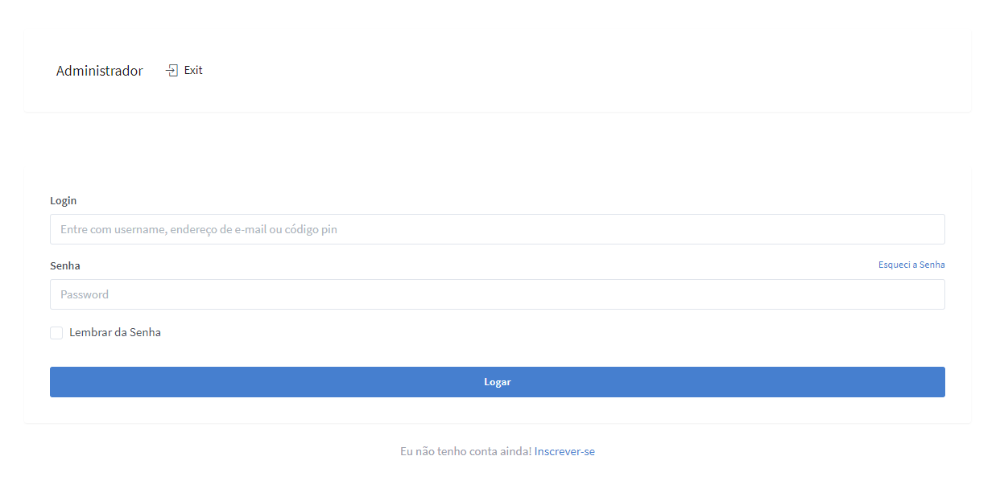
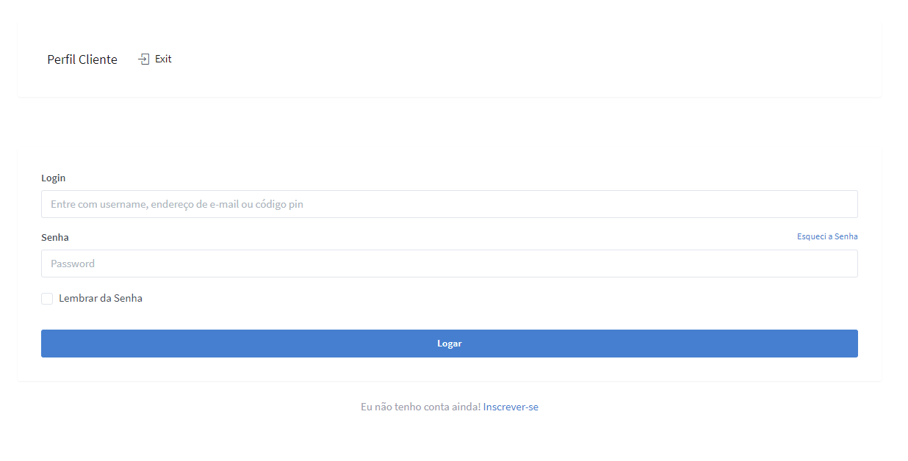
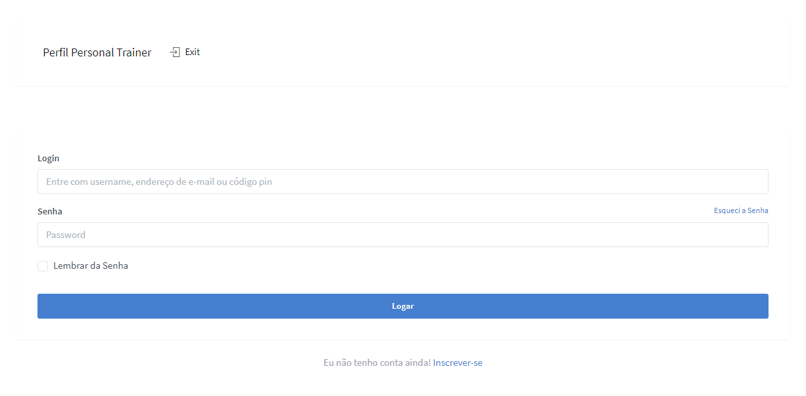

#### Recurso Disponível 

1. Opção Documentação, onde você acessa a documentação do sistema. 

2. Opção Login, onde você escolhe o tipo de usuário: Administrador, Cliente, Personal Trainer. **A opção de login faz parte da interface pública, mas o acesso ao login é exclusivo da interface privada**

 

### Página de Login / Tipo de Perfil

 

#### Recurso Disponível na página de perfil Administrador, Cliente ou Personal Trainer 

1. Ao Clicar no tipo de usuário a página de perfil é chamada. Opção Logout, onde você pode fazer logout do sistema. 

2. Opção Acessar Registro, onde você pode consultar serviços em registro do sistema.

3. Opção Serviço, onde você pode inserir serviço ao sistema.  

- *Recurso Desejável : Para o usuário Cliente serviço pode ser um pedido em solicitação para o usuário Administrador ou Personal Trainer de forma pública ou privada, caso o pedido seja público seria visível para qualquer usuário, se privado somente o usuário Administrador ou Personal Trainer podem ver.*

- *Recurso desejável: Escolher serviço como um pedido somente para o usuário Administrador ou somente para o usuário Personal Trainer*

 

#### Recurso Desejável na página de perfil Administrador, Cliente ou Personal Trainer 

1. Editar Perfil: atualizar informações ou apagar conta. *Informações de Conta: E-mail, senha, nomedeusuário, data de nascimento*

2. Acesso ao sistema via pin. *Contexto: O pin é um código numérico. Usuários podem ser encontrados ao sistema se tiverem um código numérico, caso o usuário marque a opção "permitir busca ao meu código númerico público". Se determinado usuário deseja salvar um contato, mas não sabe o número de celular, e-mail, username ou nome. Poderá utilizar o pin - código numérico para salvar o contato de perfil público.*

3. Opção **Mapa**, mostrar em endereço o número x de personal trainer, academia, serviço ou pedido.

4. Opção **Análise, Gráfico** que resume algumas informações como a quantidade x de usuários, serviços, pedidos etc. 

5. Na Opção Serviço o recurso **Pesquisar** que mostra com a opção em checkbox alguns resultados. Por exemplo, exibir apenas o personal trainer, academia, serviço, pedido, valor, endereço, número de comentários ou de estrelas. 

 
 
 

## Página de Login Administrador

 
 

## Página de Login Cliente

 
 

## Página de Login Personal Trainer

 
 

