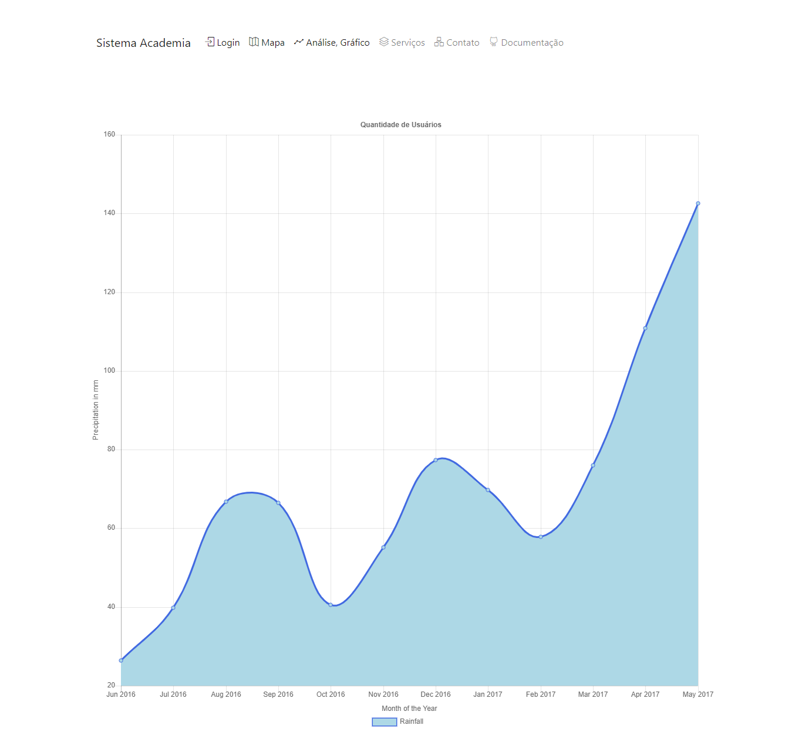
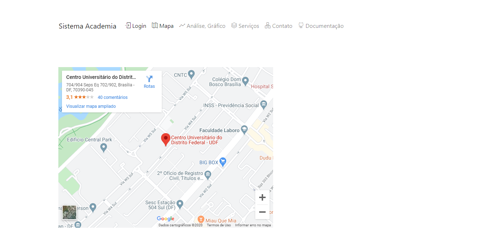
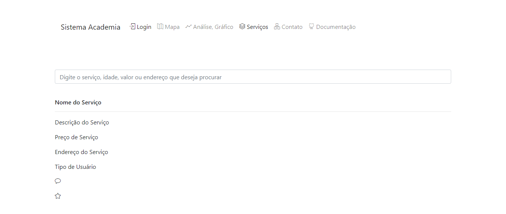

### Aviso

#

 

O screenshoot da opção de Menu **Mapa** , **Serviço** , **Contato** ou **Análise, Gráfico** mostra o recurso se tivesse em implementação. O recurso é apenas para demonstração e não está em implementação. A **Interface Pública ou mesmo menu principal** é onde as informações ou dados são acessados de forma pública como um website.

 
 

## Análise, Gráfico

 
 

## Mapa

 
 

## Serviços

 
 

### Tipos de Interface
#

Existem três tipos de interface no sistema 1. *Pública, qualquer usuário pode acessar e ver*,  2. *Restrita, apenas o usuário sistema pode acessar e ver*, 3. *Privada, apenas usuários do sistema podem acessar e ver*

 

 
 
